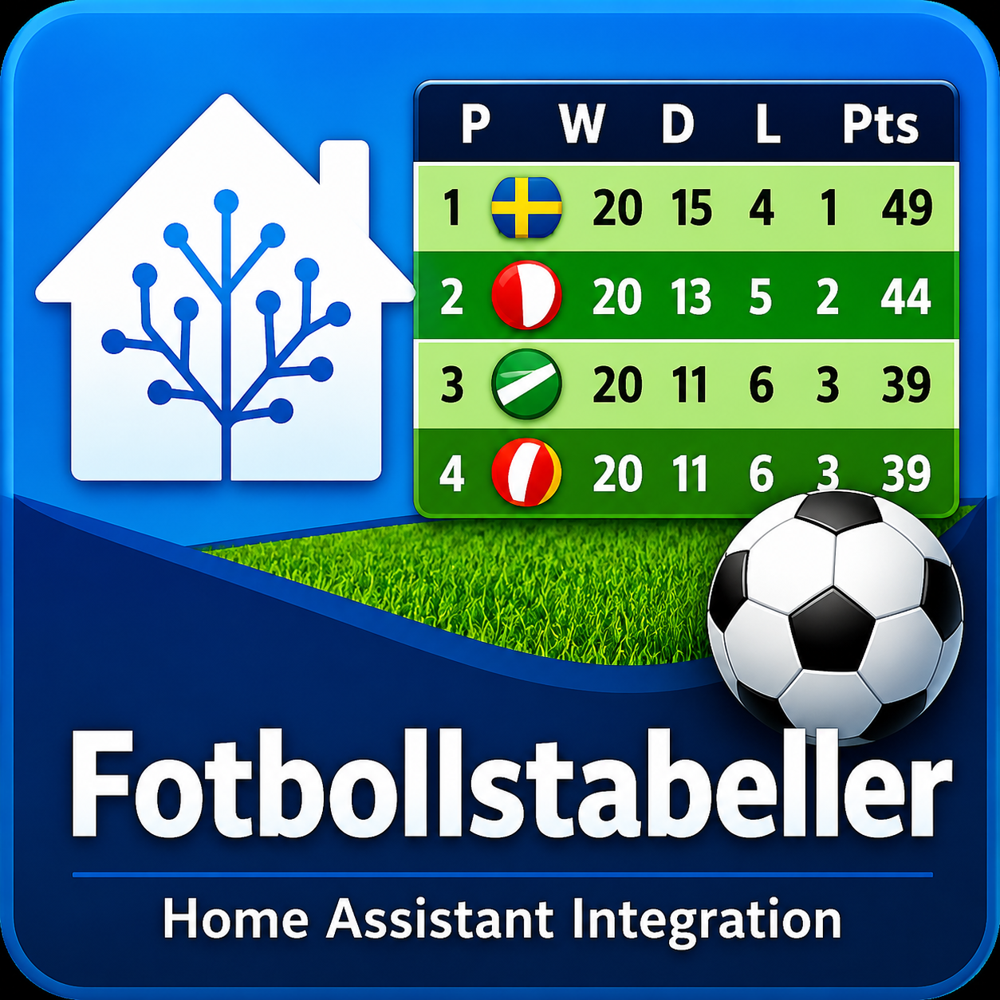

# Fotbollstabeller – Home Assistant Integration

 



A Home Assistant integration that displays Swedish football league tables from **fotbollstabeller.nu** directly in your dashboard. Supports all leagues – Allsvenskan, Superettan, Division 1–3, P17/P19/F17/F19, and more. No API key required.

---

## Features

- 📋 **Table card** with configurable columns and colors
- 🏟️ **Team card** (hero-style) with points, goal stats, and optional club image
- 🎨 **Customizable colors** – header, text, and accent directly in the card editor
- ⚡ **Zero-config** – install the integration, choose league directly in the card
- 🔄 Data fetched via WebSocket with 5 min cache
- 🔑 No API key required

---

## Installation

1. Go to **HACS → Integrations → ⋮ → Custom repositories**
2. Add `https://github.com/ostbergjohan/fotbollstabeller-hacs` as **Integration**
3. Search for **Fotbollstabeller** and click **Download**
4. **Restart Home Assistant**
5. Go to **Settings → Devices & Services → Add Integration → Fotbollstabeller**
6. Click **Submit** – done! No configuration needed.

Leagues are selected directly in the cards.

---

## Lovelace Cards

### Table Card

Add via **Edit Dashboard → Add Card → Custom: Fotbollstabeller**.

The editor allows you to:
- Select a league from a list or enter a custom URL/slug
- Set a favorite team (highlighted in yellow)
- Limit the number of rows
- Choose which columns to display
- Customize colors (header, header text, accent)

YAML example:

```yaml
type: custom:fotbollstabeller-card
group_url: allsvenskan-herrar
favorite_team: Hammarby
max_rows: 10
header_color: "#1a6b3a"
header_text_color: "#ffffff"
accent_color: "#1a6b3a"
columns:
  - position
  - team
  - played
  - won
  - draw
  - lost
  - goals
  - goal_difference
  - points
```

### Team Card

Hero card for a single team:

```yaml
type: custom:fotbollstabeller-team-card
group_url: allsvenskan-herrar
team: Hammarby
image: https://example.com/hammarby-logo.png
subtitle: Allsvenskan 2026
rows: 4
header_color: "#00543e"
accent_color: "#7dff7d"
```

**Row levels:**

| Level | Content |
|-------|---------|
| 1 | Name + position |
| 2 | + points |
| 3 | + W/D/L |
| 4 | + goals & goal difference |

---

## Color Settings

Both cards support color selection via the visual editor or YAML:

| Setting | Table Card | Team Card | Default |
|---|---|---|---|
| `header_color` | Header background | Hero + points bar | `#1a6b3a` |
| `header_text_color` | Header text color | — | `#ffffff` |
| `accent_color` | Points column | Points text | `#1a6b3a` / `#7dff7d` |

---

## Available Leagues

The dropdown in the editor includes:

- Allsvenskan & Superettan (men/women)
- Elitettan (women)
- Ettan Norra/Södra
- Division 1–3 (men/women)
- P17/P19/F17/F19 Allsvenskan & Superettan

You can also enter **any group URL** from fotbollstabeller.nu via "Custom URL".

---

## Data Source

Data is fetched by scraping the group page on [fotbollstabeller.nu](https://www.fotbollstabeller.nu/). No API key required. The card fetches data via WebSocket with a 5-minute cache.

---

## License

MIT – see [LICENSE](LICENSE) for details.
